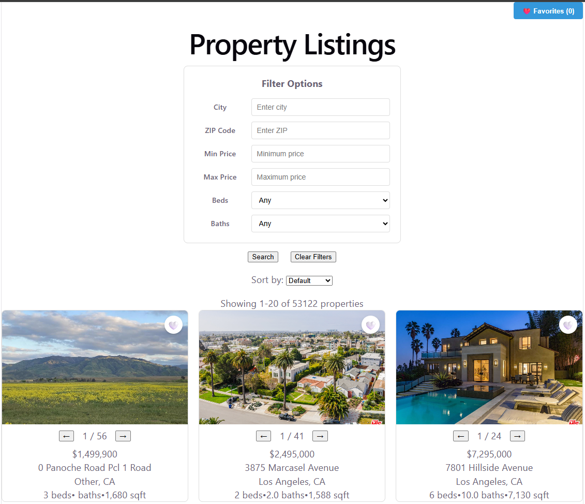

# IDX Property Search Application

## Project Description and Screenshot
A full-stack property search platform built with React (Vite), Node.js, Express, and MySQL, designed to replicate modern real estate browsing experiences using authentic MLS data.



## Tech Stack with Versions
* **Frontend:** React v18.x, Vite v5.x, React Router v6.x, Vitest, React Testing Library
* **Backend:** Node.js v18+, Express v4.x, Supertest
* **Database:** MySQL v8.0 (running in Docker)
* **Environment & Tools:** Git, Docker Desktop, npm

## Local Setup Instructions
*(Windows / macOS / Linux)*

### Prerequisites
* Install Node.js (LTS version) and npm
* Install Docker Desktop
* Use Git
* Install VS Code (Recommended, but not required)
* Download FileZilla and use FTP to get these 2 files:
  * rets_property.sql 
  * rets_openhouse.sql

*Note: you will need to ask me for the host, user, password, and port credentials in order to get the most up-to-date SQL files*

### 1. Start the Database
On Command Prompt #1
```bash
docker run --name <name-of-container> -p <some-number-from-3000-to-9999>:3306 \
  -e MYSQL_ROOT_PASSWORD=<your-password> \
  -e MYSQL_DATABASE=rets \
  -d mysql:8.0

docker exec -i <name-of-container> mysql -uroot -p<your-password> rets < rets_property.sql
docker exec -i <name-of-container> mysql -uroot -p<your-password> rets < rets_openhouse.sql
```

### 2. Clone the Repository
Continue on Command Prompt #1
```bash
git clone <repository-url> <name-of-repository>
cd <name-of-repository>
```

### 3. Backend Setup
Continue on Command Prompt #1
```bash
cd backend
npm install
echo -e "DB_HOST=localhost\nDB_PORT=<some-number-from-3000-to-9999>\nDB_USER=root\nDB_PASSWORD=<your-password>\nDB_NAME=rets" > .env
npm run dev
```
*The Express server runs on `http://localhost:5000`.*

### 4. Google Maps Setup
* Go to https://console.cloud.google.com and sign in 
* Create a new project 
* Enable the Maps Embed API under APIs & Services > Library 
* Create an API key under APIs & Services > Credentials 
* Restrict the key to localhost:3000 and the Maps Embed API only
* Make sure to copy the API key

### 5. Frontend Setup
On Command Prompt #2
```bash
cd frontend
npm install
echo -e "VITE_GOOGLE_MAPS_API_KEY=<your-google-maps-embed-api>" > .env
npm run dev
```
*The Vite development server runs on `http://localhost:3000`.*

## Architecture
```bash
[Browser / Client] 
       │ (HTTP GET with query filters / params)
       ▼
[Vite Frontend / React Router]
       │ (REST API calls via custom client wrapper)
       ▼
[Node.js / Express Backend REST API]
       │ (SQL Queries via mysql2 driver)
       ▼
[MySQL v8.0 Database (Docker Container)]
```

## API Endpoint References

### GET /api/properties
Returns paginated listings with optional filter parameters.
* **Query Parameters:** `limit`, `offset`, `city`, `zipcode`, `minPrice`, `maxPrice`, `beds`, `baths`
* **Example Request:**
  ```bash
  GET /api/properties?city=Los+Angeles&minPrice=300000&beds=3
  ```
* **Example Response:**
  ```json
  {
    "total": 2015,
    "limit": 20,
    "offset": 0,
    "results": [
      ...
    ]
  }
  ```

### GET /api/properties/:id
Returns comprehensive details for a single property by ID.
* **Example Request:** `GET /api/properties/1000291026`
* **Example Response:**
  ```json
  {
    "id": 14275,
    "L_ListingID": "1000291026",
    "L_DisplayId": "1000291026",
    "L_Address": "0 Panoche Road Pcl 1 Road",
    "L_Zip": "95043",
    "LM_char10_70": "",
    "L_AddressStreet": "Panoche Road Pcl 1",
    "L_City": "Other",
    "L_State": "CA",
    "L_Class": "Residential",
    "L_Type_": "SingleFamilyResidence",
    "L_Keyword2": 3,
    "LM_Dec_3": null,
    "L_Keyword1": "4883511.6",
    "L_Keyword5": 2,
    "L_Keyword7": "",
    "L_SystemPrice": 1499900,
    "LM_Int2_3": 1680,
    ...
  }
  ```

### GET /api/properties/:id/openhouses
Returns the scheduled open house list for a specific property.
* **Example Request:** `GET /api/properties/1174572339/openhouses`
* **Example Response:**
  ```json
  [
    {
      "id": 1,
      "L_ListingID": "1174572339",
      "L_DisplayId": "1174572339",
      "OpenHouseDate": "2026-06-20T07:00:00.000Z",
      "OH_StartTime": "14:00:00",
      "OH_EndTime": "16:00:00",
      "OH_StartDate": "2026-06-20T07:00:00.000Z",
      "OH_EndDate": "2026-06-20T07:00:00.000Z",
      ...
    }
  ]
  ```

## Database Schema Summary
The application relies on a MySQL database (`rets`) containing two core tables linked by a foreign key relationship:

* **`rets_property` (Core Listings)**
  * **Key Columns:** `L_SystemPrice`, `L_Address`, `L_City`, `L_Keyword2`, `LM_Dec_3`
  * **Description:** Stores individual real estate listings and various details about each listing like price, address, city, beds, and baths respectively
* **`rets_openhouse` (Event Schedule)**
  * **Key Columns:** `L_ListingID`, `OpenHouseDate`, `OH_StartTime`, `OH_EndTime`,
  * **Description:** Tracks upcoming open house days and time frames linked directly to specific property listings.

## Known Issues & Future Improvements
* **Image URLs:** Certain Image URLs have corrupted or invalid links, robust test handling is needed so the app does not crash.
* **Future Roadmap:** Implement user authentication for persistent saved searches and add general layout enhancements.

### Troubleshooting
* **Backend connection failures:** Verify that Docker is running via `docker ps` and that your local `.env` configuration matches root credentials.
* **CORS warnings:** Confirm that API requests route properly to the backend port (`5000`) and that proxy or base URL settings match your Vite configuration.
* **Tests failing:** Clear node modules (`rm -rf node_modules && npm install`) and verify your Node version is 18+.

### Running Tests
* **Backend Suite:** 
  ```bash
  cd backend
  npm test
  ```
* **Frontend Suite:** 
  ```bash
  cd frontend
  npm test -- --run
  ```
